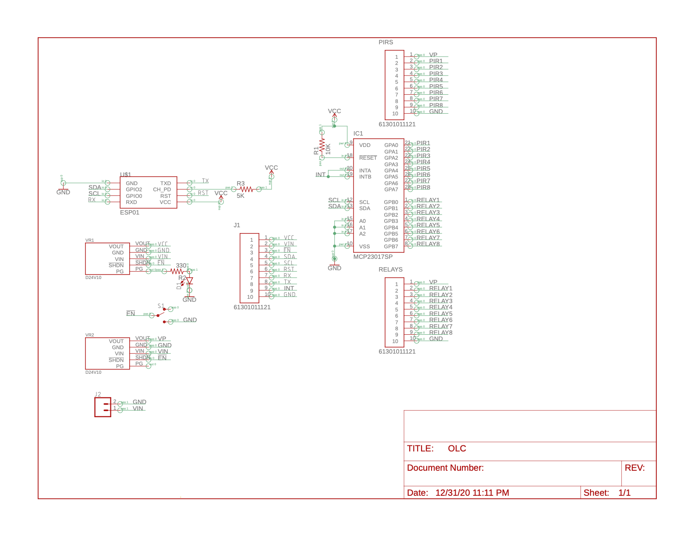

# Outdoor-Lighting-Controller

## Description

This is the hardware (PCB) and the software (ESPHome configuration) for a Home Assistant-based motion-lights controller. ESPHome is used to interface with Home Assistant, which is responsible for controlling the lights and motion alerts, etc.

## Instructions

1. Download the board files from GitHub releases (_Coming Soon!_, for now, use EAGLE to export them).
2. Order the needed parts ([parts list below](#parts-list)).
    1. I used [JLCPCB](jlcpcb.com) for the PCB; it cost me $2 (+ shipping) for 5 boards.
3. Assemble all parts on the PCB.
4. [Install ESPHome](https://esphome.io/guides/getting_started_command_line.html#getting-started-with-esphome).
5. Create the secrets file from the template.
6. Connect the ESP01 to the programming adapter.
7. Run `esphome lights.yaml compile` to compile the firmware.
8. Run `esphome lights.yaml upload` to upload the newly-compiled firmware.
9. Place the ESP01 in the PCB, paying attention to the direction of where it points

## Parts List

-   1x Custom designed Circuit Board
-   1x 8 channel Relay Board (any generic one will work as long as it supports the needed power for your lights)
-   1x MCP23017 I2C IO Expander (**IC1**)
-   1x ESP-01 module with programmer (**U1**)
-   1x [D24V10F3 Voltage Regulator](https://www.pololu.com/product/2830) (powers ESP-01) (**VR1**)
-   1x [D24V10F5 Voltage Regulator](https://www.pololu.com/product/2831) (powers the motion sensors and MCP23017) (**VR2**)
-   _up to_ 8x PIR motion sensor
-   _up to_ 8x lights and a way to power them
    -   I used 12 Volt DC LED lights and a 120VAC --> 12VDC power supply
-   jumper wires to connect the Relay Board to the PCB (either individual wires or a 1x10 cable works)
-   2x 1x10 male header (**RELAYS and J1**)
-   1x 2x4 female header (alternatively, 2 rows of 1x4 would work too) (**socket for ESP-01**)
-   1x 2-pin 3.5mm screw terminal blocks (**J2**)
-   1x 10-pin 2.54mm (0.1 in) screw terminal blocks (**PIRS**)
-   1x SPDT on/off switch (**S1**)
-   _optional_: 1x LED (**D1**) and 1x 330 ohm resistor (**R2**)
-   1x 10K ohm resistor (**R1**)
-   1x safe casing that prevents access to 120VAC power
-   1x server running Home Assistant for automating the lights in reaction to the motion sensors

## Notes

-   The ESP01 needs a 5K ohm resistor (I used a 5.2K ohm resistor I had lying around) soldered between CH_EN and VCC to operate. This will be fixed in a later board revision.
-   If ESPHome is not working properly (either not installing or not compiling), you can upload the binary in the Release using another uploading tool, such as `esptool`.
-   I tested this with ESPHome v1.15.3.

## [Schematics](assets/Schematic.pdf)

## Credits

-   [ESPHome](esphome.io)
-   [Home Assistant](home-assistant.io)
-   [Sparkfun's EAGLE libraries](https://github.com/sparkfun/SparkFun-Eagle-Libraries)
